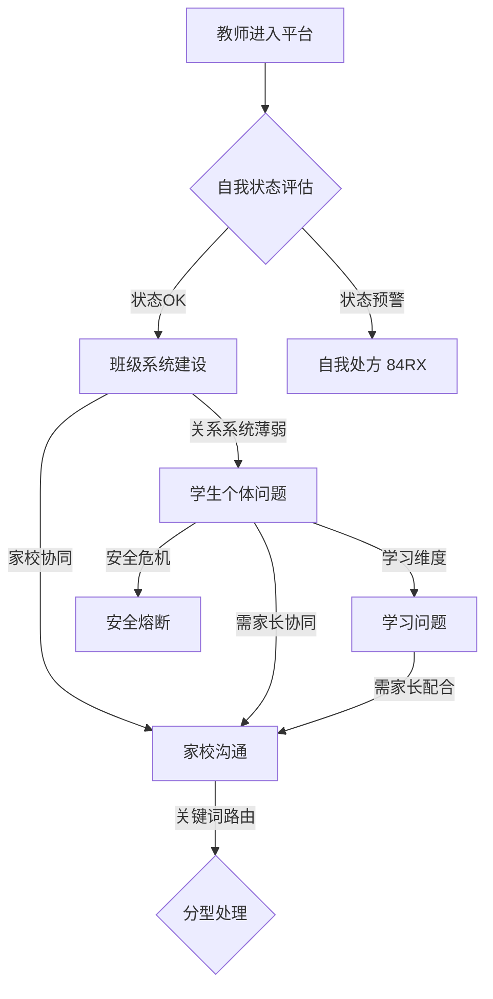

# 跨模块依赖矩阵

## 共享核心概念

以下术语在 4+ 模块中共享使用：

| 概念 | self_growth | class_system | home_school | student_case | learning_problem |
|------|:-----------:|:------------:|:-----------:|:------------:|:----------------:|
| 依恋安全/依恋关系 | — | 有 (4术语) | 有 (依恋模式评估) | 有 (核心归因维度) | 有 (依恋评估量表) |
| HERO 心理资本 | 有 (核心框架) | 有 (积极心理类) | — | 有 (归因参考) | 有 (术语) |
| 执行功能 | — | — | — | 有 (归因维度) | 有 (核心术语) |
| 元认知/心智化 | 有 (术语) | — | — | 有 (处方形式) | 有 (学习策略) |
| 容器理论 | — | — | 有 (核心) | — | — |
| 六力发展 | — | — | 有 (核心) | — | 有 (归因参考) |

## 工具互引用关系

### student_case → learning_problem 链路

```
student_case 五维快速筛查 (学习维度检出)
  → learning_problem SNAP-IV / 学习策略量表
    → 归因匹配 F→A→S→C→H 五步工具链
```

典型协同：`RX-007 心智化促进` + `C-05 作业辅导对话框架`

### class_system → student_case 链路

```
class_system 能量场问卷 (关系系统薄弱)
  → student_case 依恋安全评估 (逐个筛查)
    → RX-011/RX-012 依恋增强处方
```

### home_school 触发关键词路由

36 个关键词分属不同风险等级和路由模块：

| 关键词示例 | 风险等级 | 路由模块 | 响应 |
|-----------|:------:|---------|------|
| 自伤/自杀/暴力 | P0 | student_case | 安全熔断 → 心理转介 |
| 不配合/投诉/对抗 | — | home_school | 冲突化解工具 (D/E级) |
| 成绩下滑/不写作业 | — | learning_problem | 归因流程 |
| 孤立/被欺负 | — | student_case | 社交技能评估 |

## 评估量表递进与互补

```
self_growth: 五问(3min) → HERO+AS+PCS(中深度) → 六维深度评估(全面)

class_system: 五系统自评(15题) → 五系统专项量表
              能量场问卷(教师+学生) → 交叉验证 → 五系统诊断

student_case: 五维筛查(25题) → EBRCA诊断 → 三级响应+干预金字塔

learning_problem: SNAP-IV + 学习策略 + 学习动机 + 学业情绪 (四量表并行)
                  → 课堂观察交叉验证 → 结果判读路由(12规则)

home_school: 双维+容器速查 → 16维度细分 → 家长分型 → 沟通策略
```

## 模块业务入口触发关系

